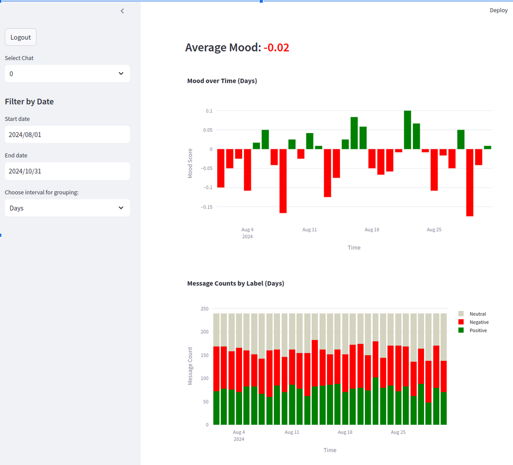

# MoodMeter: Sentiment Analysis in Telegram Chat



## Description:

MoodMeter is a system for chat sentiment analysis that uses machine learning to classify user messages as positive, neutral, or negative. The project is developed using Python, Hugging Face Transformers, Heroku (PostgreSQL), and Streamlit.

## Goals:

* Develop a chat sentiment analysis system.
* Classify user messages into three categories.
* Visualize analysis results using interactive dashboards.

## Architecture:

• Data Collection:
  * The system receives user messages from the chat via an API (e.g., Webhook).
  * Message data (text, author, timestamp) is stored in a Heroku (PostgreSQL) database.
• Sentiment Analysis:
  * A pretrained model, blanchefort/rubert-base-cased-sentiment-rurewiews from Hugging Face Transformers, is used.
  * The model classifies each message as positive, neutral, or negative.
• Data Storage:
  * Heroku is used to store messages and analysis results.
• Data Visualization:
  * Streamlit is used to create interactive dashboards visualizing the analysis results.

## Components:

• Data Collection:
  * API integration for retrieving messages from the chat.
  * Data storage in Heroku (PostgreSQL).
• Sentiment Analysis:
  * Uses the rubert-base-cased-conversational model from Hugging Face Transformers.
  * Classifies messages based on the model.
• Data Storage:
  * Creates tables in Heroku to store message and analysis data.
• Data Visualization:
  * Builds interactive dashboards in Streamlit using Plotly.

## Technical Details:

* **Python**: Programming language for implementing the system.
* **Hugging Face Transformers**: Library for working with pretrained natural language processing models.
* **Heroku (PostgreSQL)**: Database for data storage.
* **Streamlit**: Tool for creating a web service with interactive dashboards.

## Installation Instructions:

### 1. Clone the Repository:

```bash
git clone https://github.com/username/MoodMeter.git
cd MoodMeter
```

### 2. Install Python 3.11

```bash
sudo apt install python3.11
python3 --version  # Confirm that version 3.11 is installed
```

### 2. Install Python 3.11

```bash
sudo apt install python3.11
python3 --version  # Confirm that version 3.11 is installed
```

### 3. Install System Dependencies:

```bash
sudo apt install libpq-dev python3-dev
```

### 4. Create and Activate a Virtual Environment:

```bash
python3.11 -m venv myenv
source myenv/bin/activate
```

### 5. Install Python Dependencies:

```bash
pip install -r requirements-bot.txt
pip install -r requirements-streamlit.txt
```

### 6. Configure Environment:
Create a .env file in the root project directory and add the required environment variables.
```bash
HOST=
DATABASE=
USERSQL=
PORT=
PASSWORD=

TELEGRAM_TOKEN=
ADMIN_CHAT_ID=
```

### 7. Run the Application:

```bash
streamlit run moodmeter/services/dashboard.py
```

### 8. Run the Bot:

```bash
python3 moodmeter/services/telegram_bot.py
```

### Usage Example:

- The system can be used for monitoring customer sentiment in support chats.
- It can help identify topics that cause negative emotions among users.
- Data visualization allows for quick information analysis and data-driven decision making.